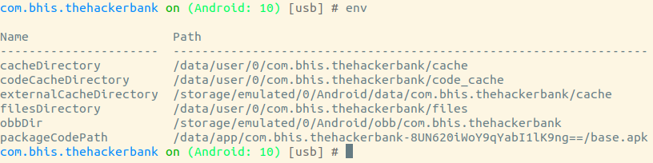
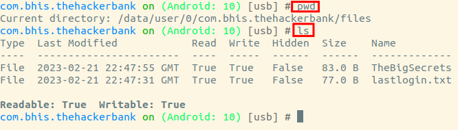
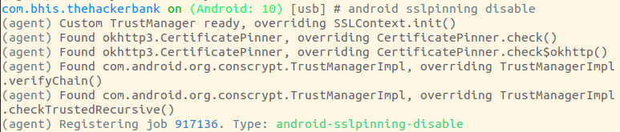

Other interesting directories that relate to the application in question may be enumerated using the env command. This will print out the locations of the applications Files, Caches and other directories:

By default, objection will start up in the main application build path. You can enter some typical unix commands such as `ls` and `pwd` into the REPL to learn more about the application.

You can also cd into any directory your app has permission to access and upload/download files.

file download <remote path> <local path>
file upload <local path> <remote path>

There are also some built in scripts to do things such as bpyass ssl pinning

You might notice that on the hacker bank, this does not work. Objection is simply using fridascripts under the hood, and we need to find a different frida script.

keystore analysis

Memory forensics.