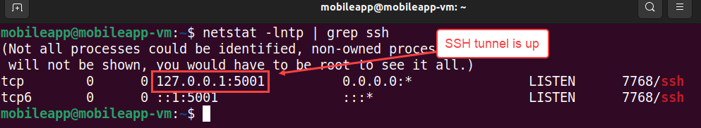
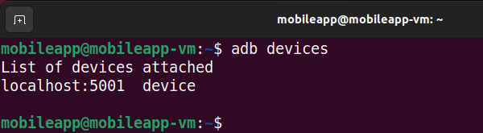
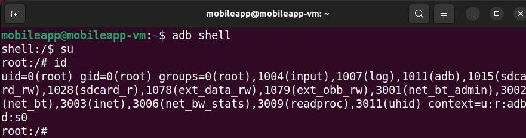
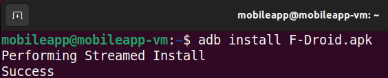
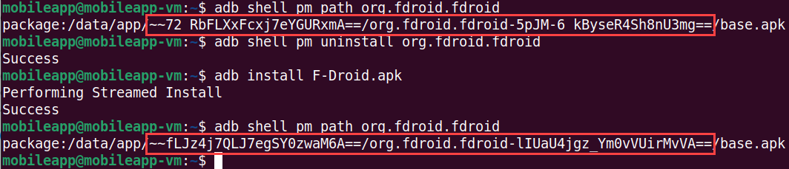
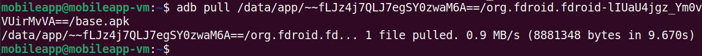
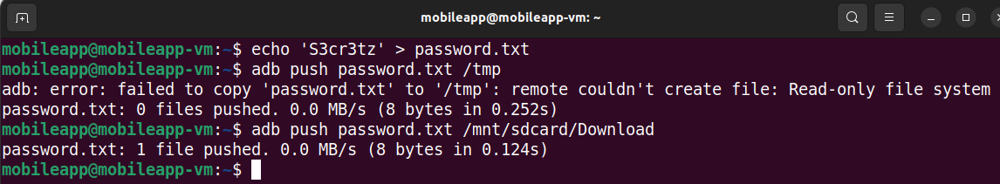
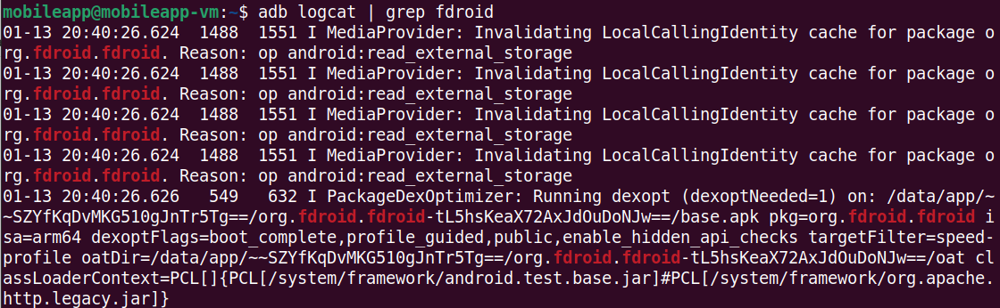

# Become an `adb` Ninja #
This lab will familiarize you with a mobile app testing tool that is indispensible for Anrdoid testing, Android Debug Bridge (adb). You will exercise some of the most common features of adb such as gaining shell access to an Android device, moving files, installing APKs, and monitoring the system logger.

The first step will be to connect to your Android device in Correllium with adb. If you have a local Android device (i.e. plugged directly into your testing system), you generally don't need to perform this step. However, since our Android device is hosted in the cloud, we'll need to take advantage of adb's TCP connection feature to remotely access the device.

Enusre that your SSH tunnel is up with the following command.


`netstat -lntp | grep ssh`



After verifying that your SSH tunnel is up, connect to your Android device with adb's connect command.

`adb connect localhost:5001`

Upon establishing the connection, you should see the message, "connected to localhost:5001"


To verify access to your Android device, use adb's devices command.

`adb devices` 



With adb connection, you can gain an interactive shell on the device. This is useful if you're just starting to explore the app and you're not quite sure what you your're looking for yet.
```
adb shell
su
id
```


If you already know exactly what you're looking for, you can also use adb's shell command to run commands interactively, even to pipe output to your local testing system. For example, maybe you're researching the security of Android's KeyChain. The following command will run on the Android device and pipe the output to your local VM. 
```
adb shell pm list packages | grep key
```


When penetration testing mobile apps, it is possible that you will receive the APK files outside of the Google Play store, as a stand-alone APK file. In which case, you will likely use adb to install the app. This is easily accomplished with adb's install command. After installing the app, you can use adb shell to find the package name after the APK is installed.

*** PLACEHOLDER: F-Droid is just a placeholder *** 

```
adb install
```


If the app you are testing is from the Google Play store, then you will want to extract the APK from the device after installing the app. This will allow you to conduct static analysis of the app. To do so, you need to find out the name of the package and the full file path where the APK file is saved to.

To find the package name, use Android's package manager utility, `pm`, to list all of the package names and pipe the output to grep to search for the package that you are testing.

`adb shell pm list packages | grep fdroid`


Use `pm` again, with the package name, to find the full path to the APK.

`adb shell pm path org.fdroid.fdroid`


That long, messy string is the full file path that we will use to copy the APK file from the device, with adb's `pull` command.

*** Find a technical, official explanation for the name / reason why the name is dynamic.

NOTE: Your file path will be different than what is listed in the this guide. The whatamacallit directory that looks weird and random is dynamically generated when an APK is installed. As a demonstration, see the following screenshot where the app has been uninstalled and re-installed. Note the differing file paths.



`adb pull /data/app/~~fLJz4j7QLJ7egSY0zwaM6A==/org.fdroid.fdroid-lIUaU4jgz_Ym0vVUirMvVA==/base.apk`



There will likely be ocassions where you need to copy a file from your testing system to the Andrdoid device. For this situation, you can use adb's push command. When copying to a device, be mindful of where you are copying to. Due to Android's file system permissioning, you might accidnatelly try to copy to a read-only location. A common location to copy files to is the `/sdcard/Download/` directory which does not require root access. In the figure below, note how I attempted to copy to the `/tmp` directory. In fact, the `/tmp` does not exist on Android by default.



A common testing technique for mobile testing is to determine if sensitive information is being sent to the system logger. The developer may have accidentally left a misplaced debug statement or perhaps the threat of leaking sensitive information in the log was not considered during development. adb's `logcat` command can be used to stream the system logger.

When adb logcat is run without any arguments, it will print literally everything to stdout which can be next to impossible to conduct menaingful analysis. When testing a mobile app, you will likely want to filter logcat's output. There are a few ways you can filter logcat's output. You could use some of logcat's built in filter mechanisms which will filter depending on the log type (e.g. error, informational, debug, all ,etc.). Another way to filter logcat's output is by the package name as this will likely correspond to the process name.

`adb logcat | grep fdroid`



If you think that the app might be spawning new processes or making inter-process communication (IPC) calls, it might be worthwhile to filter on the process (PID) associated with the app that you're testing. To do do, you can use the `ps` command to find the PID assocaited with the app you're testing and use that as a filter for logcat.

Reminder: Your PID will very likely be different than what is shown below.

```
adb shell ps | head -n 1
adb shell ps | grep fdroid
adb logcat | grep 2783
```

