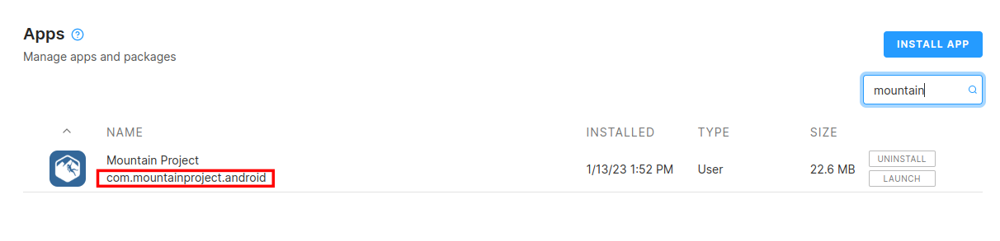
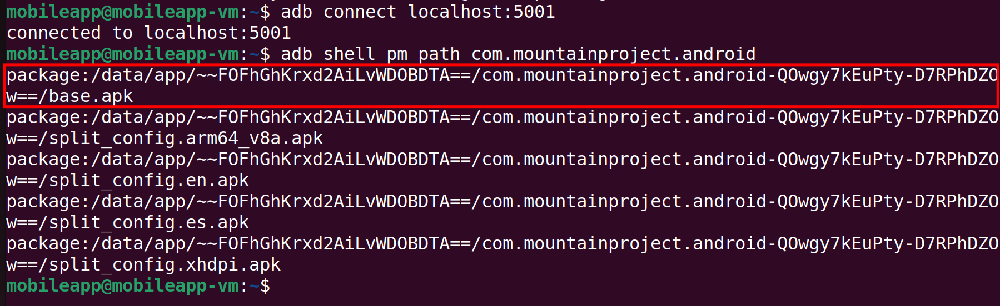
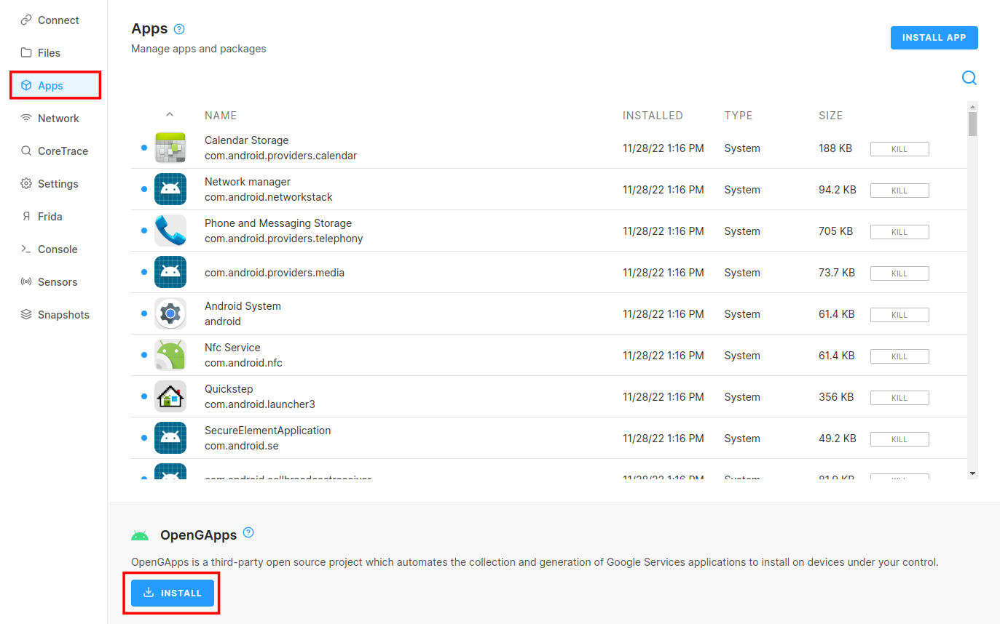

# Extracting an APK for static analysis
## Downloading the APK
Make sure you ran the ssh command under the "Connect" tab on corellium:
`ssh -M -Ssock -N -f -L 5001:<device-address>:5001 <device-id>@proxy.corellium.com`

Then make sure you are connected to the emulator through adb:
`adb connect localhost:5001`

The first thing you will need is the application ID of the app we are testing. We will be analyzing F-Droid. On the Corellium interface click on the “Apps” tab and start typing the name of the application. The application ID is found directly under the application name as shown below. 
<!---->

To download the APK from the device you will need the applications full path. To get it, connect to the the emulator via adb `adb connect localhost:5001` and run the following command:

`adb shell pm path org.fdroid.fdroid`

Copy the line in the output that ends in `base.apk` as shown below:
<!---->

next, we fun the final command:
`adb pull <PATH_TO_APP> <OUTFILE_NAME>`

## Running MobSF
[MobSF](https://mobsf.github.io/docs/#/) is already installed on your VM. To run the docker container, run the command:

`sudo docker run -it --rm -p 8000:8000 opensecurity/mobile-security-framework-mobsf:latest`

Now navigate to localhost:8000, click "Upload and Analyze", and upload an APK file. Processing the APK file will take a while, so let that keep running in the background as we will use it for future labs.

## Analyzing Other Apps
You can also test out any app youd like from the playstore. To do this you will need to install OpenGApps. This will give you access to the google playstore. This can be done from the "Apps" tab in Corellium.

**You will need to log-in with a google account before you can download any apps**
Then you can simply install apps from the play store as you normally would.
