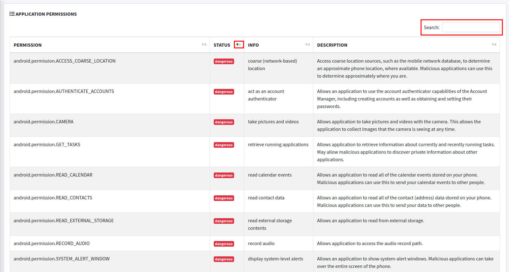
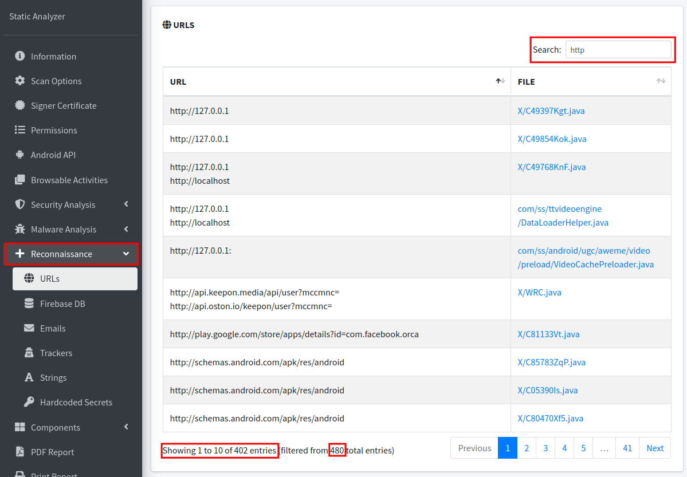
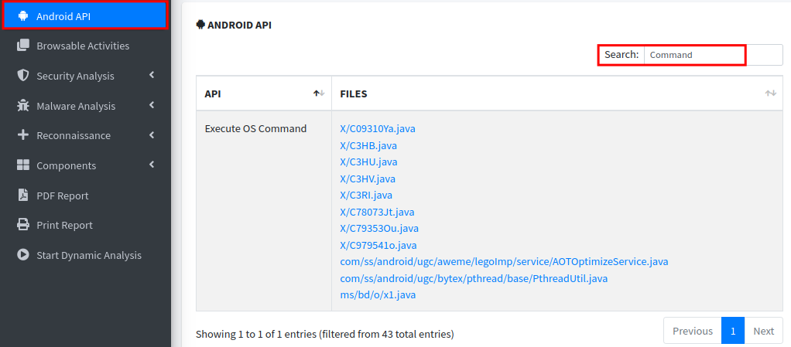
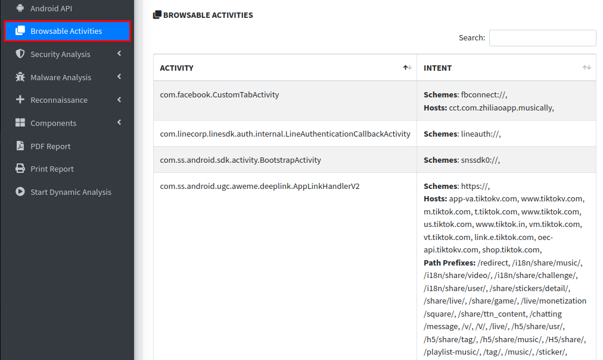
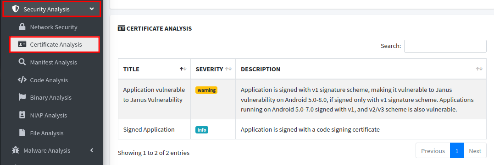

# Static Analysis with MobSF #
In this lab we will be using MobSF to analyze an APK. You can also use the app uploaded for analysis in the "APK_Extraction" lab, or look at one of the pre-generated reports in the course materials section. As an example we will be using the TikTok app. You are encouraged to repeat this analysis using TheHackerBank app. Your goal is to analyze ther results and note down anything that stands out for later use.

The first thing worth paying special attention to is the overview of the app components.

Specifically, the "exported" activities, services, receivers, and providers. The exported keyboard means they can be launched from outside the app and may present additional entry points or other attack vectors. We can further analyze the exported components by looking at the manifest file, and if necessary the decompiled code.

 
Here you can download the decompiled java, download the smali, (smali is the disassembled version of the code)

### Permissions ###
Permissions are gathered from the android manifest file. Each permission is marked with a status, most commonly "dangerous" or "normal". 

Whether a permission is actually dangerous depends on the context of the application, and whether they make sense given the functionallity of the app. Permissions are not the most useful thing for a tester, but could be critical for malware analysis.
### Recon ###
The reconnaissance section is especially useful for gaining a better overall understanding of the application. First lets look at URLs. We can use this to see where the application is making connections to, potentially for malware analysis or testing our access outside of the app.

Next we can also look at strings. Android best practices recommend that instead of hardcoding strings into the XML (UI) files, they be inserted as a key value pairs into the "Strings.xml" file and referenced by the layout files. This creates a lot of noise and looking through everything is not likely to be a good use of time.

MobSF extracts potentially sensitive values from this file and displays them in the "Hardcoded Secrets" tab. You should verify the information displayed in this section is actually sensitive before reporting it.

### API ###
This Section displays the android APIs that the app uses. This section contains a lot of noise, however it can be useful, especially when combined with the search feature.

For example, the screenshot above shows us everywhere the command execution API is used. The files displayed are clickable and will show you the API usage location in code.

### Browsable Activities ###
MobSF Extracts a list of "Browsable Activities". These are activities that can be triggered by a web browser to display data referenced by a link. These are worth attention since they can sometimes be leveraged by an attacker to perform web based or intent based attacks.

### Certificate Analysis ###

The certificate analysis section will report any known vulnerabilities in the signing schemes of the application. Make sure to validate these before reporting them, report the android versions affected, and maybe even the overall market share of the affected android versions.

