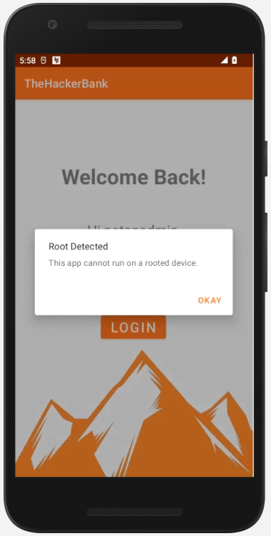
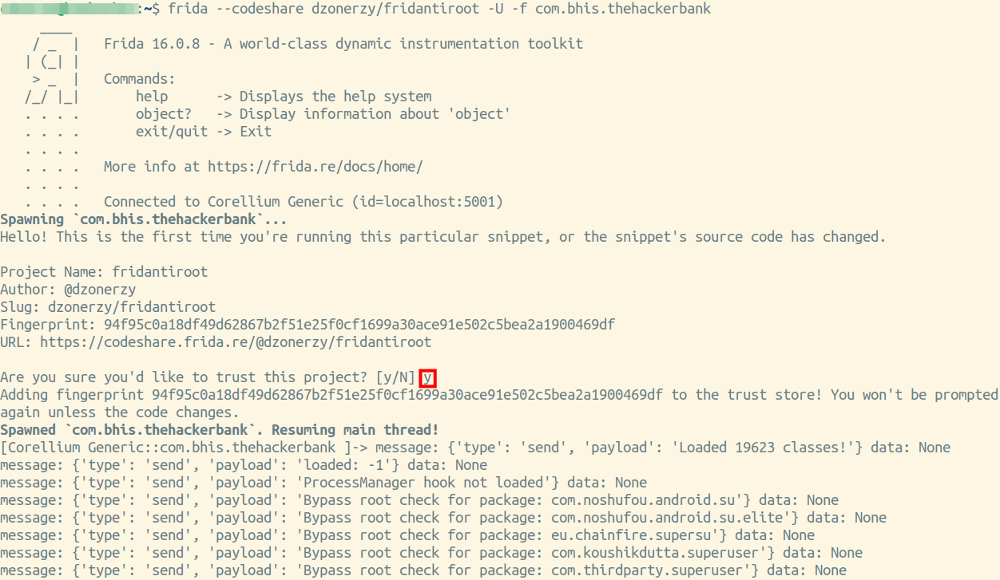

## Bypassing Root Detection using Frida
There are two potential methods of bypassing root detection, statically, by removing the relevant code and recompiling the apk, or dynamically.
In this lab, we will bypass the root detection at runtime using Frida.
The target application is `Hacker Bank Mobile`.

Let's install that app now.

From the terminal run the following to download the app.

```wget <INSERT URL HERE>```

We also need to ensure the VPN is up and running.


Now let's install the application on our phone.

`adb connect localhost:5001`


Opening the app we see that we do not have the option to do anything other than aknowledge the alert, which consequently closes the application.


**The following Commands are for reference only and do not need to be run on the Corellium device since it has the frida server pre-installed.**

Typically, we would need to upload and start the Frida server on the device we are testing. That can be accomplished by restarting adb as root, and running the following commands:

* `adb push ~/Downloads/frida-server-15.2.2-android-x86 /data/local/tmp/frida-server`

* `adb shell "chmod 755 /data/local/tmp/frida-server"`

* `adb shell "/data/local/tmp/frida-server &"`
**End of reference commands.**

We will use [This script](https://codeshare.frida.re/@dzonerzy/fridantiroot/) from Frida Codeshare to bypass root detection on our target.

You can either download the script, and run it with the `-l` option, or, run it directly from the website with ` --codeshare dzonerzy/fridantiroot`

Run the following command from a terminal on your VM:
 `frida --codeshare dzonerzy/fridantiroot -U -f com.bhis.thehackerbank`

 the `-U` option tells frida to connect to the usb device (in our case the emulator "appears" as a usb device).

 The `-f` option specifies the target application ID that we want to load. The application should **not** be running already. the `-f` flag will spawn the process.

The command output should look exactly like the screenshot below. Make sure to enter `y` when prompted if you would like to trust the project.


Looking back to your emulator screen you will now notice that the app has been launched, but this time root detection was not triggered.


Your username is `notahacker` as shown, and your password is `654321`
