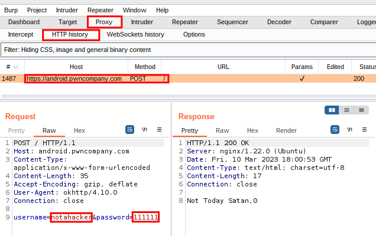
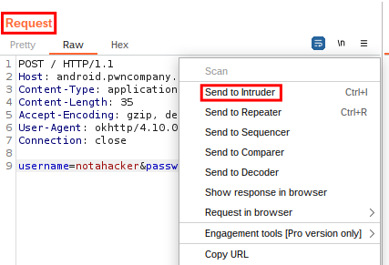

# Login BruteForce

Lets clear our burp history and make a login request to the server. From looking at the request, we can see that we have a valid user name, and we will try to brute force the password.

This example is a bit contrived, however it is a good introductin ot using burp, and illustrates the interaction between the api endpoint and the device.

We have discovered that the password policy is 6 digits. We will assume the acocunt has no brute force protection enabled

Right click on the request and click "Send to Intruder

" (or press Ctrl + I).
