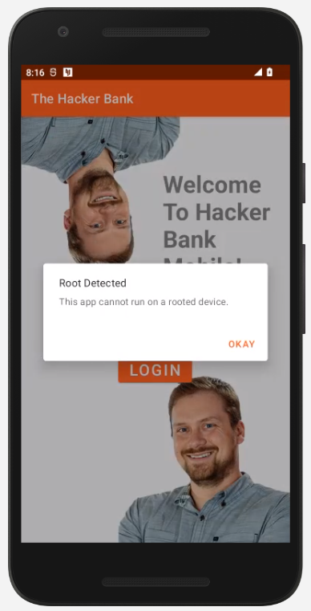

## Bypassing Root Detection with Frida
For this lab we will be using the app: Hacker Bank Mobile, which should already be installed on your device.

Opening the app we see that we do not have the option to do anything other than aknowledge the alert, closing the app. Unless...

Typically, we would need to start the Frida server on the device we are testing. That can be accomplished by restarting adb as root, and running the following commands:

`adb push ~/Downloads/frida-server-15.2.2-android-x86 /data/local/tmp/frida-server`
`adb shell "chmod 755 /data/local/tmp/frida-server"`
`adb shell "/data/local/tmp/frida-server &"`

The Corellium device emulator already has the Frida server installed, so we do not need to do any extra setup to start running commands.

We will be using [This](https://codeshare.frida.re/@dzonerzy/fridantiroot/) script from Frida Codeshare to bypass root detection on our target.

You can either download the script, and run it with the `-l` option, or, run it directly from the web with ` --codeshare dzonerzy/fridantiroot`

TODO: explain how the script actually works.

Our final command will be as follows:

 `frida --codeshare dzonerzy/fridantiroot -U -f com.bhis.supersecurebank`

 the `-U` option tells frida to connect to the usb device (in our case the emulator "appears" as a usb device).

 The `-f` option specifies the target application ID that we want to load. The application should **not** be running already. the -f flag will spawn thr process